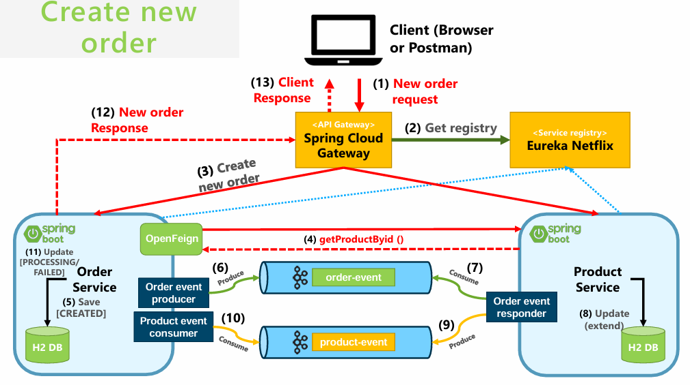

# Choreography Example using Saga Pattern

This project demonstrates a simple choreography-based workflow using the Saga pattern. The scenario involves creating orders with initial "Created" state and checking product availability before processing the order.

## Scenario:



1. **Create New Order**:

   - Create a new order with the state `CREATED`.

2. **Check Product Stock Availability**:

   - Check the stock availability of the product associated with the order.

3. **Process Order**:

   - If the product is available, change the order state to `PROCESSING`.

4. **Handle Out-of-Stock**:
   - If the product is out of stock, delete the order.

## Distributed Transaction:

This choreography example implements the Saga pattern, which orchestrates a series of local transactions across multiple services to maintain consistency in a distributed system. Each step in the scenario represents a local transaction within a service, ensuring that the system remains consistent even in the face of failures or partial completion.

## Components:

1. **API Gateway**: Exposes endpoints for interaction.
2. **Eureka Service**: Service registry for service discovery.
3. **Order Service**: Manages orders and their states.
4. **Product Service**: Handles product-related operations.

## Setup:

1. **Clone the Repository**:

   ```bash
   git clone https://github.com/ELMILYASS/SAGA-Choreography-Kafka.git
   ```

2. **Start Kafka**:

   Ensure Kafka is running locally. You can follow the Kafka documentation for installation and setup.

3. **Build and Run Services**:

   - Navigate to each service directory (`api-gateway`, `eureka-service`, `order-service`, `product-service`) and run it

4. **Accessing Endpoints**:

   - API Gateway runs on port `9999`.
   - Eureka Service runs on port `8761`.
   - Order Service runs on port `8093`.
   - Product Service runs on port `8094`.

## Usage:

1. **View All Products**:

   ```http
   GET http://localhost:9999/PRODUCT-SERVICE/AllProducts
   ```

2. **Check Stock of a Product**:

   ```http
   GET http://localhost:9999/PRODUCT-SERVICE/Stock/{prodId}/{qnt}
   ```

3. **Create a New Order**:

   ```http
   GET http://localhost:9999/ORDER-SERVICE/new/{prodId}/{qnt}
   ```

4. **View Details of an Order**:

   ```http
   GET http://localhost:9999/ORDER-SERVICE/{orderId}
   ```

5. **View All Orders**:

   ```http
   GET http://localhost:9999/ORDER-SERVICE/AllOrders
   ```
